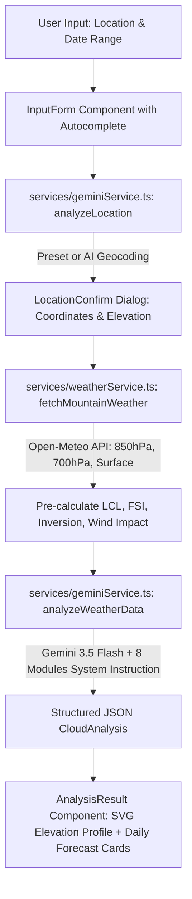

# 🤖 AGENTS.md — CloudHunter AI System Architecture & Developer Agent Guidelines

This document provides specialized system documentation, architecture contracts, mathematical foundations, and development guidelines for **AI Coding Agents** (Antigravity, Claude, Gemini, DeepSeek, Cursor, Windsurf, Copilot) working on or extending the **CloudHunter AI** codebase.

---

## 📌 Executive Overview for AI Agents

**CloudHunter AI** is a hybrid meteorological forecasting web app specializing in **sea of clouds (biển mây) prediction** and **trekking microclimate analysis** for mountain peaks in Vietnam (specifically the Northwest region).

### Core Operational Workflow


---

## 📁 Key File Index & Code Responsibilities

| File Path | Description & Responsibility | Crucial Export / Function |
| :--- | :--- | :--- |
| `types.ts` | Complete TypeScript type contracts for weather inputs, daily forecasts, technical indices, terrain profiles, and cloud analysis. | `WeatherInput`, `DailyForecast`, `CloudAnalysis`, `TechnicalIndices`, `LocationAnalysis` |
| `services/geminiService.ts` | Core AI Engine. Contains `SYSTEM_INSTRUCTION` (8 meteorological modules), `analyzeLocation`, and `analyzeWeatherData`. Calls Gemini API using `@google/genai`. | `analyzeLocation()`, `analyzeWeatherData()` |
| `services/weatherService.ts` | Fetches real-time / historical upper-air numerical data from Open-Meteo API at 850hPa & 700hPa pressure levels. Pre-computes LCL, FSI, and Inversion. | `fetchMountainWeather()` |
| `constants/mountains.ts` | Extended database of verified mountains with precise coordinates (`lat`, `lon`), elevation, microclimate zone classification (`A_CLOUD_TRAP` vs `B_WIND_TUNNEL`). | `MOUNTAIN_DB`, `MountainInfo` |
| `constants.ts` | Hardcoded terrain elevation profiles, waypoint markers, descriptions, and Vietnamese search aliases for preset peaks. | `NORTHWEST_PEAKS`, `PeakPreset` |
| `components/InputForm.tsx` | UI input form with real-time fuzzy search autocomplete over `NORTHWEST_PEAKS`. | `InputForm` |
| `components/LocationConfirm.tsx` | Intermediate modal allowing users to confirm/adjust location coordinates, elevation, and observer altitude before running the heavy model. | `LocationConfirm` |
| `components/AnalysisResult.tsx` | Visual rendering engine for forecast cards, technical parameters, expert tips, and the custom SVG `TerrainVisualizer`. | `AnalysisResult`, `TerrainVisualizer` |
| `App.tsx` | Main application state manager orchestrating the multi-step flow (`INPUT` $\rightarrow$ `CONFIRM` $\rightarrow$ `ANALYZING` $\rightarrow$ `RESULT`). | `App` |

---

## 🧮 Mathematical & Meteorological Foundations

When adding new analysis modules or modifying existing heuristics in `services/geminiService.ts` or `services/weatherService.ts`, AI agents MUST adhere to these atmospheric physics rules:

### 1. Lifting Condensation Level (LCL Base Height)
$$\text{LCL (meters)} = 125 \times (T_{\text{surface}} - Td_{\text{surface}})$$
* **$T_{\text{surface}}$**: 2-meter air temperature (°C)
* **$Td_{\text{surface}}$**: 2-meter dew point temperature (°C)
* **Physical Interpretation**: Approximates the height at which a rising air parcel becomes saturated and cloud formation begins.

### 2. Wind-Weighted Fog Stability Index (FSI)
$$\text{FSI} = 2(T_{\text{surface}} - Td_{\text{surface}}) + 2(T_{\text{surface}} - T_{850\text{hPa}}) + W_{\text{impact}}$$
Where $W_{\text{impact}}$ is derived from 850hPa (~1500m) wind speed ($W_{850}$ in km/h):
* $W_{850} < 10 \text{ km/h} \Rightarrow W_{\text{impact}} = 0$ (`wind_impact_level: "Low"`)
* $10 \le W_{850} < 15 \Rightarrow W_{\text{impact}} = W_{850} \times 1$ (`wind_impact_level: "Medium"`)
* $15 \le W_{850} \le 20 \Rightarrow W_{\text{impact}} = W_{850} \times 1$ (`wind_impact_level: "High"`)
* $W_{850} > 20 \text{ km/h} \Rightarrow W_{\text{impact}} = W_{850} \times 2$ (`wind_impact_level: "Destructive"`)

**FSI Decision Matrix**:
* **$\text{FSI} < 30$**: High probability of dense, stable cloud sea.
* **$30 \le \text{FSI} \le 50$**: Moderate fog or flowing clouds (mây luồn).
* **$\text{FSI} > 50$**: Poor stability; clouds torn apart or clear sky.

### 3. Thermal Inversion Detection (Cloud Top Elevation)
* Ground/Subsidence Inversion occurs when $T_{850\text{hPa}} > T_{\text{surface}}$.
* Inversion Trapping: Warm air aloft acts as a lid, trapping moisture in valleys below 1500m–1800m.
* Inversion Strength:
  * $T_{850} - T_{\text{surf}} > 0 \Rightarrow \text{"Strong"}$
  * $T_{850} - T_{\text{surf}} > -2 \Rightarrow \text{"Moderate"}$
  * $T_{850} - T_{\text{surf}} > -4 \Rightarrow \text{"Weak"}$
  * Else $\Rightarrow \text{"None"}$

### 4. Boundary Fluctuation Rule ($\Delta H$)
$$\Delta H = H_{\text{observer}} - H_{\text{cloud\_top}}$$
* **$\Delta H > 300m$**: Observer is safely above the cloud layer $\rightarrow$ Pristine, flat sea of clouds.
* **$\Delta H \le 200m$**: **Fluctuating / Rolling Zone** $\rightarrow$ Thermal updrafts cause cloud layer to rise and drop in waves, periodically engulfing the observer in fog.

### 5. Microclimate Terrain Zones
* **Zone A (Cloud Traps / Bồn Giữ Ẩm)**: Narrow, winding valleys (Y Tý, Tà Xùa, Ky Quan San). High tolerance for light winds up to 12 km/h.
* **Zone B (Wind Tunnels & Leeward / Ống Gió & Sườn Khuất)**: Wide valleys & Venturi gaps in Lai Châu (Pu Ta Leng, Tả Liên Sơn). High sensitivity to wind ($W_{850} > 8 \text{ km/h}$ destroys clouds).

---

## 🛠️ Guidelines for AI Coding Agents

### Rule 1: Schema Integrity & Strict JSON Formatting
When modifying `geminiService.ts` or `types.ts`:
- **DO NOT** remove or rename properties in `CloudAnalysis`, `DailyForecast`, or `TechnicalIndices`.
- Always verify that `responseSchema` in `geminiService.ts` matches the `CloudAnalysis` TypeScript interface in `types.ts`.
- Ensure Gemini output parsing handles markdown wrappers (` ```json ... ``` `) and raw JSON string fallbacks cleanly.

### Rule 2: Preservation of the 8 Meteorological Modules
The `SYSTEM_INSTRUCTION` prompt string in `geminiService.ts` contains the core intellectual property of CloudHunter AI.
- **DO NOT** delete or weaken any of the 8 modules (LCL, FSI, Wind/Moisture Matrix, Cloud Altimeter, Boundary Fluctuation, Topographic Fluid Dynamics, Seasonal Calibration, Golden Hour Protocol).
- When introducing a new module (e.g., Module 9), follow the established mathematical and domain format.

### Rule 3: Graceful Degradation & Fallback Handling
- If Open-Meteo API fails or returns missing data for specific dates, set `status_code` to `"UNKNOWN"`, `status_text` to `"Chưa xác định (Thiếu dữ liệu)"`, and set `dataReliability` to `"LOW"`.
- **DO NOT** throw unhandled exceptions or crash the app interface. The catch block in `analyzeWeatherData` must return a structured fallback `CloudAnalysis` object.

### Rule 4: Vietnamese Text Normalization
Use `removeVietnameseTones()` when comparing location names or alias inputs to handle user entries with or without diacritical marks (`Ta Xua`, `ta xua`, `Tà Xùa`).

---

## 🚀 Priority Backlog for AI Agents (Future Tasks)

If you are an AI agent asked to add new features to CloudHunter AI, prioritize the following tasks:

1. **Task A: Multi-Model Ensemble Fetcher (`services/weatherService.ts`)**
   - Add support for querying multiple forecast models from Open-Meteo (`models=ecmwf_ifs025,gfs_seamless,icon_seamless`).
   - Calculate standard deviation across models to return a `modelConsensusScore` (0–100%).

2. **Task B: Dynamic Waypoint Observer Altitude Selector (`components/AnalysisResult.tsx`)**
   - Add interactive slider or dropdown in `TerrainVisualizer` allowing users to select which waypoint altitude they are staying at (e.g. 1900m Homestay vs 2860m Peak).
   - Recalculate $\Delta H$ and re-trigger boundary fluctuation logic client-side.

3. **Task C: Solar Azimuth & Golden Hour Precise Timer**
   - Integrate a lightweight solar position formula to compute exact sunrise/sunset timestamps and solar elevation angle for the mountain coordinates on the target date.

4. **Task D: GPX & Offline Forecast Export**
   - Implement a button to export the daily forecast, safety checklist, and terrain waypoint profile as a downloadable JSON / GPX file for offline trekking use.

---

## 🧪 Verification Commands

Before concluding any work on this codebase, AI agents MUST execute the following verification steps:

```bash
# 1. Check TypeScript compile errors
npm run lint

# 2. Build production applet
npm run build
```
