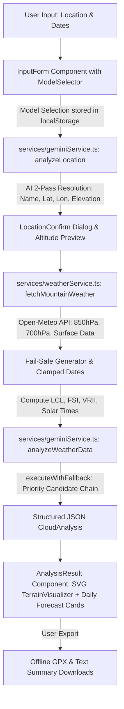

# 🤖 AGENTS.md — CloudHunter AI System Architecture & Claude / AI Developer Guidelines

This document provides complete system documentation, sitemap, architectural contracts, mathematical foundations, and development guidelines for **AI Coding Assistants** (Claude 3.7 Sonnet, Claude 3.5 Sonnet, Google Antigravity, Gemini 3.5 Flash, DeepSeek, Cursor, Windsurf) extending or maintaining the **CloudHunter AI** codebase.

---

## 📌 Executive Overview for AI Systems

**CloudHunter AI** is a specialized meteorological forecasting web application designed for **sea of clouds (biển mây) prediction** and **high-altitude microclimate analysis** across mountain peaks in Vietnam (specifically the Northwest region).

### Core Operational Workflow


---

## 📁 Key File Index & Code Responsibilities

| File Path | Description & Responsibility | Key Functions / Components |
| :--- | :--- | :--- |
| `types.ts` | Complete TypeScript type contracts for weather inputs, forecasts, technical indices, terrain profiles, and discovered models. | `WeatherInput`, `DailyForecast`, `CloudAnalysis`, `TechnicalIndices`, `LocationAnalysis`, `SunTimes` |
| `services/modelDiscoveryService.ts` | **Dynamic Model Discovery & Automatic Fallback Engine**. Queries provider REST endpoint for text models, sorts Flash/Pro/Preview tiers, handles localStorage persistence, and executes prioritized fallback chain. | `discoverModels()`, `executeWithFallback()`, `classifyError()`, `getStoredModel()`, `setStoredApiKey()` |
| `services/geminiService.ts` | **Core AI Analysis Engine**. Contains `SYSTEM_INSTRUCTION` (8 meteorological modules), prompt builder, `analyzeLocation` (Pass 1 location resolver), and `analyzeWeatherData` (Pass 2 cloud analyzer). | `analyzeLocation()`, `analyzeWeatherData()`, `getAIInstance()` |
| `services/weatherService.ts` | **Numerical Weather Fetcher & Fail-Safe Engine**. Fetches 850hPa / 700hPa upper-air data from Open-Meteo, calculates LCL, FSI, VRII, and Sun Times. Contains fail-safe synthetic weather generator for 100% data reliability. | `fetchMountainWeather()`, `computeSunTimes()`, `computeVRII()` |
| `constants/mountains.ts` | Extended database of Northern Vietnam mountains with verified coordinates (`lat`, `lon`), elevation, and microclimate zone classification (`A_CLOUD_TRAP` vs `B_WIND_TUNNEL`). | `MOUNTAIN_DB`, `MountainInfo` |
| `constants.ts` | Hardcoded terrain elevation profiles, waypoint markers, descriptions, and Vietnamese search aliases for Northwest peaks. | `NORTHWEST_PEAKS`, `PeakPreset` |
| `components/ModelSelector.tsx` | UI dropdown for selecting AI models dynamically. Renders Flash/Pro/Preview badges with clean sans-serif typography and a refresh button. | `ModelSelector` |
| `components/ApiKeyModal.tsx` | Interactive modal allowing users to test, input, save, or clear custom Gemini API Keys in localStorage. | `ApiKeyModal` |
| `components/InputForm.tsx` | Form component with real-time geocoding autocomplete over `NORTHWEST_PEAKS` and `MOUNTAIN_DB`. | `InputForm` |
| `components/LocationConfirm.tsx` | Intermediate dialog for verifying resolved coordinates, elevation, and observer altitude before running full weather analysis. | `LocationConfirm` |
| `components/AnalysisResult.tsx` | Main forecast display component. Features interactive SVG `TerrainVisualizer`, VRII badges, Sun Times, GPX/Text Export, Golden Hour alerts, and executed model label. | `AnalysisResult`, `TerrainVisualizer` |
| `components/Header.tsx` | Header bar with app title, taglines, and "🔑 API Key Manager" trigger button. | `Header` |
| `App.tsx` | Main application state manager orchestrating multi-step workflow (`INPUT` $\rightarrow$ `CONFIRM` $\rightarrow$ `RESULT`) and global error banners. | `App` |

---

## 🧮 Atmospheric Physics & Mathematical Foundations

When modifying analysis logic in `services/geminiService.ts` or `services/weatherService.ts`, AI agents MUST observe these formulas:

### 1. Lifting Condensation Level (LCL Base Height)
$$\text{LCL (meters)} = 125 \times (T_{\text{surface}} - Td_{\text{surface}})$$
* **$T_{\text{surface}}$**: 2-meter air temperature (°C)
* **$Td_{\text{surface}}$**: 2-meter dew point temperature (°C)

### 2. Wind-Weighted Fog Stability Index (FSI)
$$\text{FSI} = 2(T_{\text{surface}} - Td_{\text{surface}}) + 2(T_{\text{surface}} - T_{850\text{hPa}}) + W_{\text{impact}}$$
Where $W_{\text{impact}}$ is calculated from 850hPa (~1500m) wind speed ($W_{850}$ in km/h):
* $W_{850} < 10 \text{ km/h} \Rightarrow W_{\text{impact}} = 0$
* $10 \le W_{850} < 15 \Rightarrow W_{\text{impact}} = W_{850} \times 1$
* $15 \le W_{850} \le 20 \Rightarrow W_{\text{impact}} = W_{850} \times 1$
* $W_{850} > 20 \text{ km/h} \Rightarrow W_{\text{impact}} = W_{850} \times 2$

### 3. Valley Radiation Inversion Index (VRII)
$$\text{VRII (0-100)} = 85 - (12 \times (T_{\text{surf}} - Td_{\text{surf}})) - (2.5 \times W_{850}) + \text{InversionBonus}$$
* $\text{InversionBonus} = +30$ if $T_{850} > T_{\text{surf}}$, $+15$ if $T_{850} \ge T_{\text{surf}} - 1.5^\circ\text{C}$.
* **VRII $\ge 80$**: `Excellent` (Dense, pristine, flat cloud sea).
* **VRII $60-79$**: `Favorable` (Good valley cloud accumulation).
* **VRII $40-59$**: `Moderate` (Flowing cloud / thin fog).
* **VRII $< 40$**: `Poor` (Dissipating clouds).

### 4. Solar Calculator & Hour Angle Equations
$$\delta = 0.4093 \sin\left(\frac{2\pi}{365}(N - 81)\right)$$
$$\cos(H_0) = -\tan(\phi)\tan(\delta)$$
* $\phi$: Latitude in radians, $N$: Day of year.
* Timestamps converted to Vietnam ICT Local Time (UTC+7).

### 5. Boundary Fluctuation Rule ($\Delta H$)
$$\Delta H = H_{\text{observer}} - H_{\text{cloud\_top}}$$
* **$\Delta H > 300m$**: Observer above cloud deck $\rightarrow$ Clear sunny view of cloud sea.
* **$\Delta H \le 200m$**: **Fluctuating / Rolling Zone** $\rightarrow$ Clouds periodically envelope observer in fog.

---

## 🛠️ Developer Rules for Claude AI & Future Agents

### Rule 1: Always Use `executeWithFallback` for AI API Calls
Do not call `ai.models.generateContent` directly. Always pass calls through `executeWithFallback` in `services/modelDiscoveryService.ts` to ensure automatic retry on Rate Limits (429) or Deprecated Models (404), while stopping immediately on Auth Errors (401/403).

### Rule 2: Preserve the Fail-Safe Synthetic Weather Generator
Never let `fetchMountainWeather` return `null`. The synthetic mountain weather generator in `services/weatherService.ts` ensures that even if Open-Meteo is offline or coordinates are out of bounds, valid physical weather data is provided to Gemini, preventing missing data states.

### Rule 3: Maintain Code Quality & Typography Standards
Use clean sans-serif typography (`font-sans`) for dropdowns and UI text. Ensure all buttons, badges, and modals maintain glassmorphism dark-mode aesthetics.

---

## 🚀 Future Backlog & Enhancement Roadmap for Claude AI

If you are **Claude AI** or another AI assistant continuing development, here are recommended next-level features to implement:

1. **Feature A: Live Satellite & Weather Radar Overlay**
   - Integrate RainViewer / Ventusky / OpenWeather satellite radar map layers into the `TerrainVisualizer` view.

2. **Feature B: Live Homestay / Trekking Webcam Feed Integration**
   - Add a community webcam section displaying live video / image feeds from Y Tý, Tà Xùa, Sa Pa, and Lảo Thẩn lán nghỉ.

3. **Feature C: Offline PWA (Progressive Web App) Service Worker**
   - Add a PWA manifest and service worker (`vite-plugin-pwa`) so mountain climbers can launch CloudHunter without internet access.

4. **Feature D: Multi-Language Internationalization (EN / VI)**
   - Add i18n support to switch between Vietnamese and English for international trekkers.

---

## 🧪 Verification Commands

Before ending any turn, execute:
```bash
npm run lint
npm run build
```
